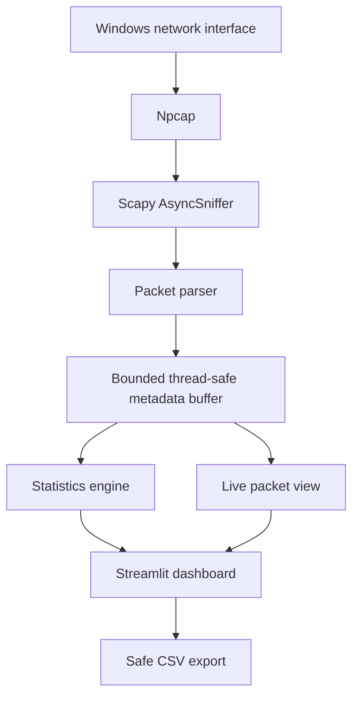

# Network Packet Sniffer & Traffic Analyzer

## CodeAlpha Cyber Security Internship

This project was developed as an internship submission for CodeAlpha. It is an educational defensive-security project intended only for authorized network monitoring.

## Task

**Task 1 — Basic Network Sniffer**

## Overview

A beginner-friendly, portfolio-ready dashboard for authorized monitoring of traffic visible to a Windows computer. It captures packets with Scapy, extracts privacy-conscious metadata, calculates live statistics, and presents the result in Streamlit.

> Use this project only on systems and networks you own or are explicitly authorized to inspect. It contains no packet injection, spoofing, decryption, credential collection, or interception features.

## Objectives

- Capture traffic from a user-selected Windows network interface.
- Explain packet structure through readable IPv4/IPv6 and transport metadata.
- Identify common protocols without attempting to decrypt encrypted traffic.
- Present live packet metadata and lightweight statistics in a responsive dashboard.
- Export only an approved set of metadata fields to CSV.
- Keep the design understandable for an internship demonstration.

## Features

- Background capture without freezing the dashboard
- Simple `Auto (recommended)` and `All active interfaces` capture choices
- IPv4 and IPv6 metadata parsing
- TCP, UDP, ICMP, DNS, HTTP-like, HTTPS/TLS, and common-service labels
- Timestamp, addresses, ports, length, IP version, TCP flags, summary, and payload length
- Optional sanitized 64-byte payload preview, disabled by default
- Live table, protocol distribution, timeline, rankings, and traffic metrics
- Protocol and IP filters
- Metadata-only CSV download
- Graceful empty states and actionable Windows error messages
- Synthetic unit tests that do not require live capture

## Architecture



The single capture manager is stored with `st.cache_resource`, so Streamlit reruns reuse it instead of creating duplicate capture threads. See [docs/architecture.md](docs/architecture.md) for details.

## Technology Stack

- Python 3.10+
- Scapy for capture and packet layers
- Npcap for Windows packet access
- Pandas for small tabular/time-series operations
- Streamlit for the dashboard
- Pytest for logic tests

The concise technology comparison and official references are in [docs/research.md](docs/research.md).

## Requirements

- Windows 10/11
- Python 3.10 or newer
- Current Npcap installation
- Administrator terminal recommended for predictable capture access
- Authorization to monitor the selected interface

## Installation

Install Npcap from its official site with **WinPcap compatibility mode disabled**, then in PowerShell:

```powershell
cd C:\path\to\CodeAlpha_BasicNetworkSniffer
python -m venv .venv
.\.venv\Scripts\Activate.ps1
python -m pip install --upgrade pip
python -m pip install -r requirements.txt
```

If activation is blocked, run `Set-ExecutionPolicy -Scope Process -ExecutionPolicy Bypass` and retry. The complete clean-machine walkthrough is in [docs/installation.md](docs/installation.md).

## Usage

Open PowerShell as Administrator, activate the environment, and run:

```powershell
python -m streamlit run app.py
```

Then:

1. Keep **Auto (recommended)** selected for normal internet traffic. Use **All active interfaces** only when traffic may cross Wi-Fi, virtual, and loopback adapters.
2. Leave payload preview off unless a controlled demo needs it.
3. Click **Start Capture**.
4. Generate normal traffic from the same computer.
5. Inspect the live table, statistics, and packet details.
6. Click **Stop Capture**.
7. Download filtered metadata as CSV.

More detail is available in [docs/usage.md](docs/usage.md).

## Dashboard

The top row reports total packets, TCP, UDP, ICMP, and total observed bytes. The remaining sections show live packets, an exclusive transport/protocol distribution, average packet size, DNS count, top endpoints and ports, a one-second timeline, packet details, and CSV export.

Filters affect metrics, charts, details, and exported rows. The maximum displayed-packets setting limits only table rendering.

## Packet Information

Each supported packet can include:

- timestamp
- source and destination IP
- detailed protocol label and transport
- source and destination port when present
- observed packet length and IP version
- TCP flags and Scapy summary
- payload presence and length
- optional bounded/sanitized preview

Full raw payload is not stored or exported.

## Protocol Analysis

DNS uses Scapy's DNS layer, and ICMP uses protocol layers. HTTP-like traffic requires a visible request/response start line, rather than relying only on port 80. Common ports provide an additional service hint for FTP, SSH, Telnet, SMTP, DHCP, POP3, IMAP, HTTPS/TLS, and RDP.

Port labels are best-effort and are not proof of the application protocol. HTTPS/TLS content is encrypted; this basic sniffer identifies metadata but does not and must not decrypt it.

## Testing

Run the automated suite:

```powershell
python -m pytest -q
```

Safe manual checks:

```powershell
ping 8.8.8.8
nslookup example.com
curl.exe http://example.com/
curl.exe https://example.com/
```

Expected observations and the test matrix are in [docs/testing.md](docs/testing.md). Live capture results vary by interface, Npcap configuration, DNS mode, and network policy.

Final local audit evidence:

- `11 passed` in the synthetic Pytest suite.
- Streamlit `AppTest` loaded the dashboard without an application exception.
- A Windows/Npcap live diagnostic captured DNS, HTTP, HTTPS/TLS, TCP, and UDP traffic in both Auto and All-active modes. Counts depend on background traffic and are not fixed expectations.

## Screenshots

The submission checklist is in [docs/screenshots.md](docs/screenshots.md). It covers environment proof, app startup, interface choice, live ICMP/DNS/TCP/UDP traffic, charts, details, CSV export, and the final dashboard. Redact network and personal identifiers before submission.

## Project Structure

```text
CodeAlpha_BasicNetworkSniffer/
├── app.py
├── requirements.txt
├── README.md
├── LICENSE
├── .gitignore
├── sniffer/
│   ├── __init__.py
│   ├── capture.py
│   ├── parser.py
│   ├── protocols.py
│   └── statistics.py
├── utils/
│   ├── __init__.py
│   └── export.py
├── docs/
│   ├── research.md
│   ├── architecture.md
│   ├── installation.md
│   ├── usage.md
│   ├── testing.md
│   ├── screenshots.md
│   ├── troubleshooting.md
│   ├── GITHUB_UPLOAD_GUIDE.md
│   ├── VIDEO_RECORDING_GUIDE.md
│   ├── VIDEO_TRANSCRIPT_EN.md
│   ├── VIDEO_CHEATSHEET.md
│   ├── LINKEDIN_POST.md
│   ├── LINKEDIN_UPLOAD_GUIDE.md
│   ├── SUBMISSION_FORM_GUIDE.md
│   ├── FINAL_AUDIT.md
│   └── FINAL_SUBMISSION_CHECKLIST.md
├── tests/
│   ├── test_parser.py
│   ├── test_statistics.py
│   └── test_export.py
└── sample/
    └── sample_packets.csv
```

## Limitations

- Captures traffic visible to the selected local interface, not arbitrary unrelated devices on a switched network.
- Live capture requires working Npcap access and may require elevation.
- Application-protocol classification is best-effort.
- Encrypted TLS content is not readable.
- Loopback traffic requires either **All active interfaces** or the individual loopback adapter under Advanced options.
- NIC offload can create apparent checksum or segment-size artifacts.
- The 10,000-record buffer prioritizes UI stability over long-term forensic retention.
- This is an educational analyzer, not a lossless high-throughput capture appliance.

## Security / Ethics

- Never capture without authorization.
- Payload preview is off by default, bounded, sanitized, and excluded from CSV.
- Do not commit exports, PCAP files, credentials, cookies, or private captures.
- `.gitignore` excludes packet files, virtual environments, secrets, and runtime exports.
- The committed sample uses documentation-reserved synthetic IP ranges.

## Troubleshooting

For no packets, missing Npcap, permissions, wrong interfaces, reruns, duplicate servers, UI slowness, loopback, or offload artifacts, see [docs/troubleshooting.md](docs/troubleshooting.md).

## Future Improvements

- User-selectable BPF capture filters
- Rate and bandwidth charts
- Optional PCAP export with explicit privacy warnings
- More protocol-aware Scapy layers
- Automated Windows integration test on a dedicated authorized lab machine
- Capture-session summaries generated from synthetic/demo traffic

## Internship Requirement Mapping

| CodeAlpha Requirement | Implementation |
|---|---|
| Python packet capture | `CaptureManager` using Scapy `AsyncSniffer` |
| Analyze packet structure | IPv4/IPv6 packet parser and details view |
| Understand data flow and protocols | Protocol classification, transport counts, endpoints, ports, and timeline |
| Use Scapy or socket | Scapy selected after documented comparison |
| Source IP | Live table, detail view, filters, and top-source chart |
| Destination IP | Live table, detail view, filters, and top-destination chart |
| Protocol | Layer-aware/best-effort protocol labels and distribution |
| Payload | Presence and length by default; optional bounded sanitized preview |
| Simple web dashboard | Streamlit metrics, table, charts, details, and controls |
| Export | Required eight-column metadata-only CSV download |

## License

MIT — see [LICENSE](LICENSE).
