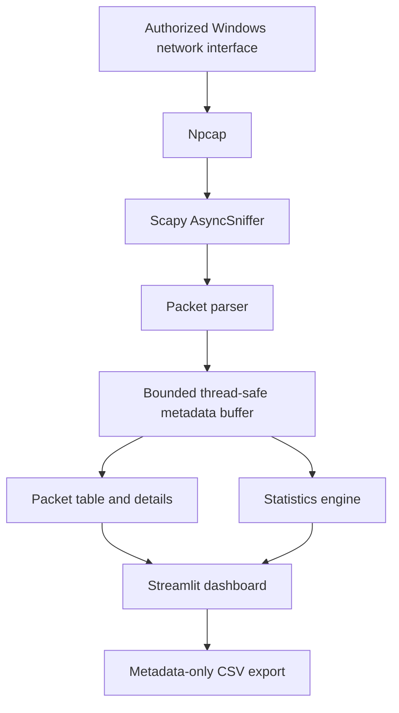

# Architecture

## Data flow

## Components

- `sniffer/capture.py` owns one `AsyncSniffer`, a lock, and a bounded 10,000-record buffer. Streamlit stores this manager with `st.cache_resource`, so normal reruns reuse it.
- `sniffer/parser.py` accepts IPv4/IPv6 packets and extracts metadata. It never returns full raw payload. An explicit option adds only a sanitized 64-byte preview.
- `sniffer/protocols.py` combines Scapy layer evidence, visible HTTP start lines, transport type, and common-port hints.
- `sniffer/statistics.py` computes counts, traffic volume, rankings, and one-second time buckets.
- `utils/export.py` allowlists eight columns, ensuring optional previews cannot enter CSV output.
- `app.py` handles controls, filters, charts, empty/error states, and periodic fragment refreshes.

## Thread lifecycle

1. The cached manager begins in `Stopped` state.
2. **Start Capture** validates the interface and refuses to create another worker when already running.
3. Scapy invokes a small callback on its background thread. The callback parses one packet and appends it under a lock.
4. The dashboard reads a copied snapshot, never the mutable buffer itself.
5. **Stop Capture** calls `stop(join=True)` and returns the manager to `Stopped`.
6. **Clear Data** empties metadata without affecting the running capture.

The buffer is intentionally bounded; older display records are discarded if a long capture exceeds 10,000 parsed packets.

## Privacy boundary

Only traffic visible on the selected local interface is observed. Full payload, credentials, cookies, and packet files are not exported. The optional preview is off by default, is printable-text sanitized, and is never included in CSV.

